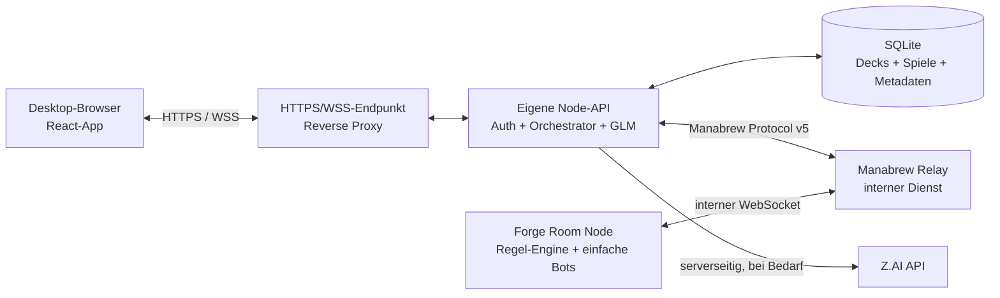

# Architekturentscheidung: Prozess- und Lizenzgrenzen

Status: beschlossen fuer Milestone 1 (`ARCH-001`, 26.09.2026)

## Entscheidung

Der Browser spricht ausschliesslich mit unserer eigenen Node/TypeScript-API. Die API ist Backend-for-Frontend, Spiel-Orchestrator und alleiniger Manabrew-Relay-Client fuer menschliche Spieler. Manabrew-Relay und Forge-backed self-hosted node bleiben getrennte interne Dienste. SQLite speichert Anwendungsdaten; Forge bleibt waehrend einer laufenden Partie die Autoritaet fuer Regeln und Spielzustand.

Fuer die lokale Entwicklung duerfen Relay- und Health-Ports wie im bestehenden PoC an `localhost` gebunden sein. Im NAS-Betrieb sind nur Reverse Proxy beziehungsweise API/Web-App von aussen erreichbar. Relay, Forge und SQLite liegen in einem internen Compose-Netz.

## Verantwortungen

### Browser und React-App

- Rendert ausschliesslich ein eigenes, stabiles UI-Modell.
- Sendet Benutzerabsichten mit einer app-eigenen Spiel-, Sitz- und Prompt-ID an die API.
- Besitzt weder Relay-Passwort noch Server-Key, GLM-Key oder Datenbankzugang.
- Trifft keine Regelentscheidung und betrachtet lokal gespeicherten Zustand nicht als autoritativ.
- Erhaelt nur die fuer den angemeldeten Sitz erlaubte Perspektive.

### Node/TypeScript-API

- Prueft Invite-/Playgroup-Sitzung und WebSocket-Verbindung.
- Verwaltet je aktiver Partie einen Orchestrator und die Relay-Verbindung fuer den menschlichen Sitz.
- Korreliert `gameId`, Spieler, letzten `gameView`, aktiven `promptId` und Verbindungszustand.
- Uebersetzt Relay-/Engine-Envelopes in app-eigene Events und validiert alle externen Nachrichten mit dem Shared-Parser.
- Leitet Antworten nur weiter, wenn Partie, Sitz und aktuelle `promptId` uebereinstimmen.
- Startet Raum, Deckwahl, drei Bots und Partie ueber den wiederverwendbaren Manabrew-Client.
- Speichert Decks, Metadaten, Logs und spaeter versionierte Save-Artefakte in SQLite beziehungsweise einem serverseitigen Datenverzeichnis.
- Ruft Z.AI nur serverseitig auf. Tutor-Ausgaben sind Erklaerungen; sie veraendern keine Engine-Regeln oder legalen Aktionen.

Die API wird damit Relay-Client **und** Orchestrator. Sie ist nicht selbst die Regel-Engine. Das verhindert, dass Manabrew-spezifische Transportformen direkt zum Browservertrag werden.

### Manabrew Relay

- Vermittelt Lobby-, Raum- und Engine-Nachrichten.
- Kennt den Relay-Server-Key und die Raumkonfiguration.
- Ist kein Speicherort fuer Deckbibliothek, Benutzerzugang, GLM-Secrets oder dauerhafte Saves.
- Ist im Produktbetrieb nicht direkt aus dem Internet erreichbar.

### Forge-backed self-hosted node

- Fuehrt die autoritative Magic-/Commander-Partie aus.
- Erzeugt legale Aktionen, Prompts, Zustandsansichten und die drei einfachen Bots.
- Bleibt ein eigener Prozess/Container und wird nicht in die Node-API eingebettet.
- Darf nicht durch UI-, Tutor- oder Persistenzlogik ersetzt werden.

### SQLite

SQLite speichert zunaechst Nutzer-/Playgroup-Sitzungen, Deckbibliothek, Spielmetadaten, Engine-/Deckversionen und strukturierte Logs. Ein sichtbares `gameView` ist kein vollstaendiges Savegame. Interner Engine-Zustand wird erst gespeichert, wenn `SAVE-001` einen belastbaren Export-/Restore-Weg nachweist.

## Laufzeitfluss

1. Der Browser tauscht den privaten Playgroup-Code bei der API gegen eine kurzlebige, sichere Sitzung aus.
2. Die API oeffnet oder uebernimmt eine Relay-Sitzung und ordnet sie einer internen `gameId` und einem menschlichen Sitz zu.
3. Die API setzt die ausgewaehlten Decks, fordert drei Bots in einem Batch an und startet nach vier bereiten Sitzen die Partie.
4. Die API validiert jede Relay-Nachricht, speichert den letzten vollstaendigen Sitz-State sowie den aktuellen Prompt und erzeugt daraus app-eigene Events.
5. Der Browser sendet eine Auswahl mit `gameId`, app-eigener Zustandsversion und `promptId` zurueck.
6. Die API verwirft alte, doppelte oder sitzfremde Antworten. Eine gueltige Antwort wird in das Manabrew-Format uebersetzt und ueber den Relay gesendet.
7. Nur ein nachfolgender Engine-State bestaetigt, dass die Aktion wirksam wurde.

Das vorhandene Capture-Skript bleibt ein Diagnosewerkzeug. `ENGINE-001` extrahiert daraus den wiederverwendbaren Relay-Client; die React-App importiert diesen Client nicht.

## Reconnect- und Ausfallverhalten

| Ausfall | Verhalten in Milestone 1 | Noch zu beweisen |
| --- | --- | --- |
| Browser neu geladen / kurz offline | API haelt die Relay-Sitzung. Nach erneuter WSS-Anmeldung sendet sie den letzten State und offenen Prompt erneut. | Session-/Sitzbindung und doppelte Antwort unterdruecken. |
| Browser laenger getrennt | Partie darf serverseitig weiterlaufen, soweit die Engine nicht auf eine menschliche Entscheidung wartet. Die API markiert den Sitz als getrennt. | Timeout-/Abbruchregel fuer unbeantwortete Prompts. |
| API verliert Relay-WebSocket | Exponentieller Reconnect mit Jitter; nach Verbindung Raum-/Spielsitzung wiederherstellen und Resync anfordern. Bis dahin keine Browseraktion annehmen. | `ENGINE-001` muss Retake/Resync gegen den echten Relay beweisen. |
| API-Prozess startet neu | Persistierte Sitzungs- und Spielmetadaten laden, Relay neu verbinden und Resync versuchen. | Ob ein menschlicher Sitz nach Prozessverlust sicher uebernommen werden kann, ist noch kein abgeschlossener Proof. |
| Relay startet neu | API und Forge-node verbinden neu. Spiel gilt erst nach erfolgreichem Resync wieder als aktiv. | Gemeinsamer Restart-Test mit laufender Partie. |
| Forge-node / Engine startet neu | Laufende Partie gilt vorerst als verloren und wird als unterbrochen markiert. | `SAVE-001`/`SAVE-002` muessen echten Engine-Restore nach Prozessneustart beweisen. |
| Z.AI nicht erreichbar | Partie bleibt spielbar; Explain liefert einen klaren Fehler beziehungsweise lokalen Fallback. | Frist, Retry und Kostenlimit in `GLM-002`. |

Die API darf einen gecachten State nach Verbindungsverlust nur als letzte bekannte Ansicht kennzeichnen. Sie darf daraus keine neuen legalen Aktionen ableiten. Ein alter `promptId` wird nie nach einem neueren State erneut beantwortet.

## Secrets und Daten

| Wert | Ablage | Darf in den Browser? |
| --- | --- | --- |
| `MANABREW_SERVER_KEY` | Server-Secret / Compose-Secret | Nein |
| Raum-Passwort | API-/Server-Konfiguration | Nein |
| Z.AI API-Key | API-Secret | Nein |
| Invite-/Playgroup-Code | Gehasht in der Anwendungsdatenbank; Klartext nur bei Eingabe | Nur bei Eingabe |
| Browser-Sitzung | Secure-, HttpOnly-, SameSite-Cookie; serverseitig widerrufbar | Cookie, nicht JavaScript-lesbar |
| Decklisten und Saves | Server-Datenverzeichnis / SQLite; Zugriff je Playgroup | Nur gefiltert ueber API |
| Raw-Captures | Lokale Diagnose, ignoriert und zeitlich begrenzt | Nein |

Produktive Secrets werden nicht in Images, Repository, Browser-Bundle oder Logs geschrieben. `.env` bleibt nur lokale Entwicklungsform; NAS-Betrieb soll Container-/Dateisecrets mit eingeschraenkten Rechten verwenden. Logs enthalten keine fremden Haende, Bibliotheksreihenfolgen, Invite-Codes oder Authorization-Header.

## Deployment-Grenze

Milestone 1 verwendet mindestens diese Laufzeiteinheiten:

1. `web`: statische React-Dateien oder Auslieferung ueber denselben Reverse Proxy;
2. `api`: Node/TypeScript-API, WebSocket-Endpunkt, Orchestrator und GLM-Client;
3. `relay`: unveraenderter beziehungsweise exakt versionierter Manabrew-Relay;
4. `forge-room`: exakt versionierter Forge-backed self-hosted node;
5. persistentes Volume fuer SQLite, Decks, Saves und strukturierte Logs.

Fuer reproduzierbare Builds werden Manabrew-Images vor dem NAS-Test auf eine konkrete Version beziehungsweise einen Digest festgelegt. `latest` bleibt nur fuer den vorhandenen PoC und darf nicht die spaetere Produktionskonfiguration bestimmen. API- und Engine-Health sind getrennt; ein gesunder Relay bedeutet nicht, dass eine Partie wiederherstellbar ist.

## Lizenzgrenze

Diese Architekturentscheidung ist eine technische Abgrenzung und keine Rechtsberatung. `LEGAL-001` bleibt fuer den vollstaendigen Asset- und Lizenznachweis offen.

- Manabrews Referenzimplementierung ist laut Projekt unter `AGPL-3.0-or-later` lizenziert; der eingebundene Forge-Bestand bleibt `GPL-3.0-or-later`.
- Die Manabrew-Protokollspezifikation unter `/protocol/` ist separat `CC-BY-4.0` lizenziert und laedt unabhaengige Implementierungen ein. Unsere TypeScript-Typen, Parser und API werden als eigene Protokollimplementierung gepflegt; es wird kein Manabrew-Quellcode in diese Pakete kopiert.
- Die geforderte CC-BY-Namensnennung wird in einer dauerhaften Third-Party-/About-Ansicht mit Autor/Projekt, Link zur Spezifikation, Lizenzlink und Aenderungshinweis umgesetzt.
- Relay und Forge-node bleiben klar bezeichnete Drittanbieterkomponenten in getrennten Containern. Lizenztexte, Copyright-Hinweise und Bezugsquelle der verwendeten Version werden im Deployment erhalten.
- Falls wir Manabrew selbst veraendern und diese Version Netzwerkbenutzern bereitstellen, muss die laufende Anwendung diesen Benutzern ein gut sichtbares Angebot fuer den entsprechenden Quellcode der modifizierten Version machen. Ein privater Betrieb hebt diese Pflicht gegenueber den tatsaechlichen Netzwerkbenutzern nicht automatisch auf.
- Die Prozessgrenze allein garantiert keine lizenzrechtliche Unabhaengigkeit, wenn spaeter AGPL-Code kopiert, statisch/dynamisch eingebunden oder als abgeleitetes Werk veraendert wird. Solche Aenderungen brauchen vor Umsetzung eine dokumentierte Pruefung in `LEGAL-001`.
- Kartenbilder, Kartentexte, Wizards-Marken und Scryfall-Daten haben eigene Bedingungen. Diese Entscheidung erlaubt keine Assets; der MVP soll keine fremden Bildpakete ins Repository aufnehmen.

Primaerquellen:

- [Manabrew-Lizenz und Protokollabgrenzung](https://github.com/witchesofthehill/manabrew/blob/cfaf2431c872b87fc8a7208e873a92140755f47d/LICENSE.md)
- [Manabrew-Protokollspezifikation und CC-BY-Hinweis](https://docs.manabrew.app/protocol/)
- [GNU AGPL 3.0, insbesondere Abschnitt 13](https://www.gnu.org/licenses/agpl-3.0.html#section13)
- [Creative Commons Attribution 4.0, Bedingungen zur Namensnennung](https://creativecommons.org/licenses/by/4.0/legalcode.en#s3a)

## Konsequenzen und offene Nachweise

Mit dieser Entscheidung sind `APP-001` und `ENGINE-001` nicht mehr durch `ARCH-001` blockiert. Die naechste Arbeit ist das Web-/API-Grundgeruest (`APP-001`); danach beziehungsweise in demselben vertikalen Slice wird der Relay-Client extrahiert.

Folgende Punkte sind bewusst noch kein bewiesenes Verhalten:

- Retake/Resync eines menschlichen Sitzes nach Neustart der API;
- Erhalt einer laufenden Partie nach Relay-Neustart;
- Engine-Save/Restore nach Forge-Prozessneustart;
- sichere produktive Anmeldung per Playgroup-Code;
- konkrete Lizenz und Copyright-Hinweise fuer den eigenen Repository-Code;
- konkrete Kartenbild-/Scryfall-Nutzung.

Diese Punkte bleiben in `ENGINE-001`, `SAVE-001`, `AUTH-001` und `LEGAL-001` nachverfolgbar.
